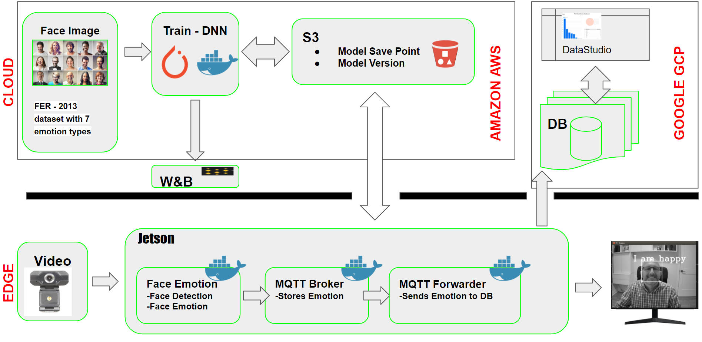
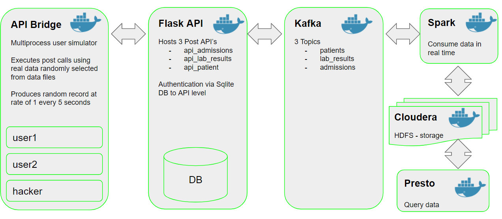
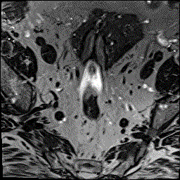
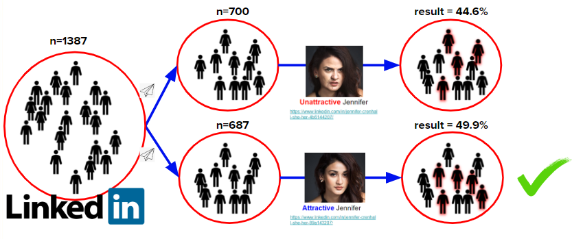
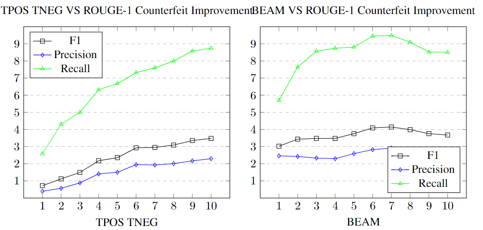
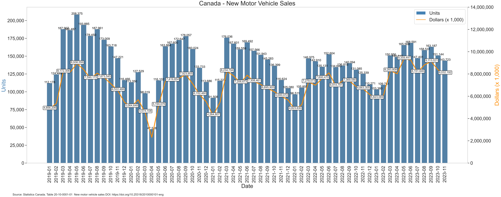
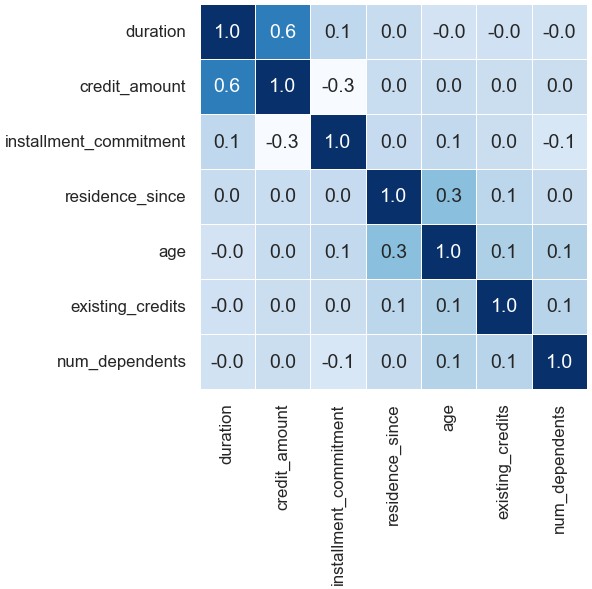
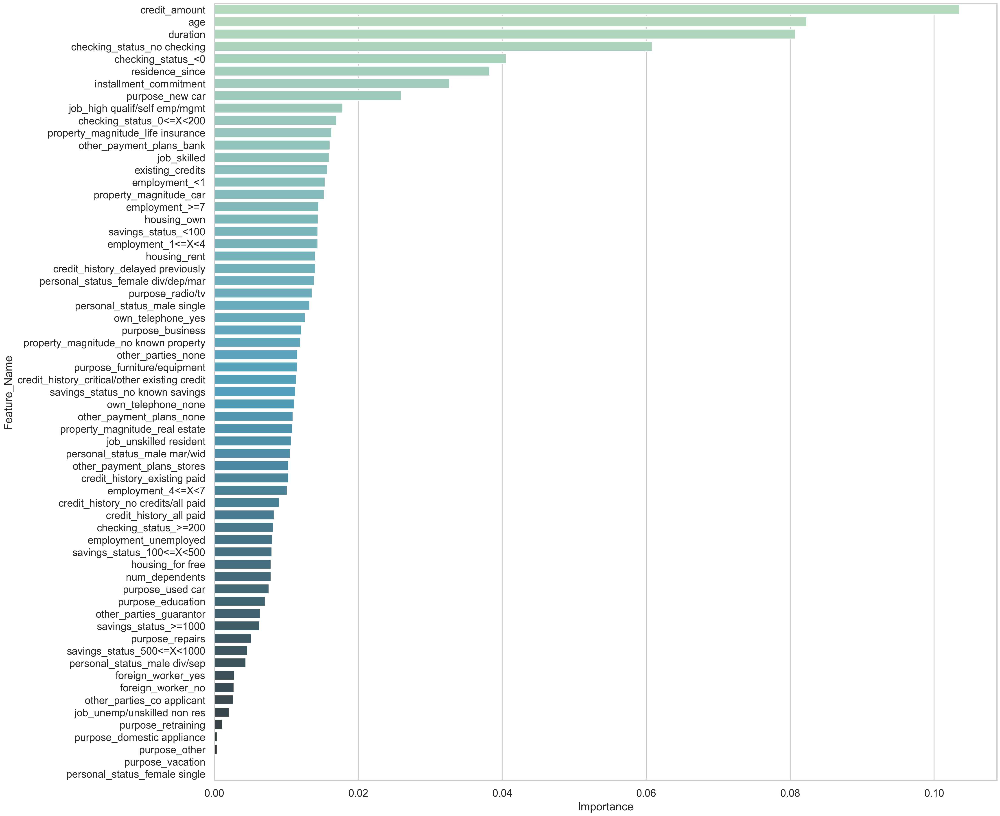
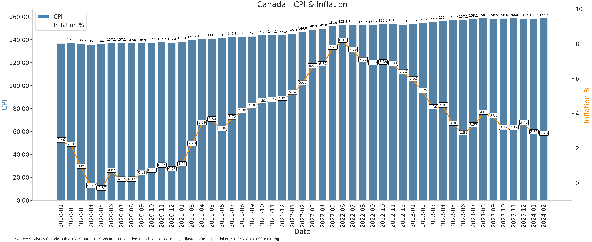
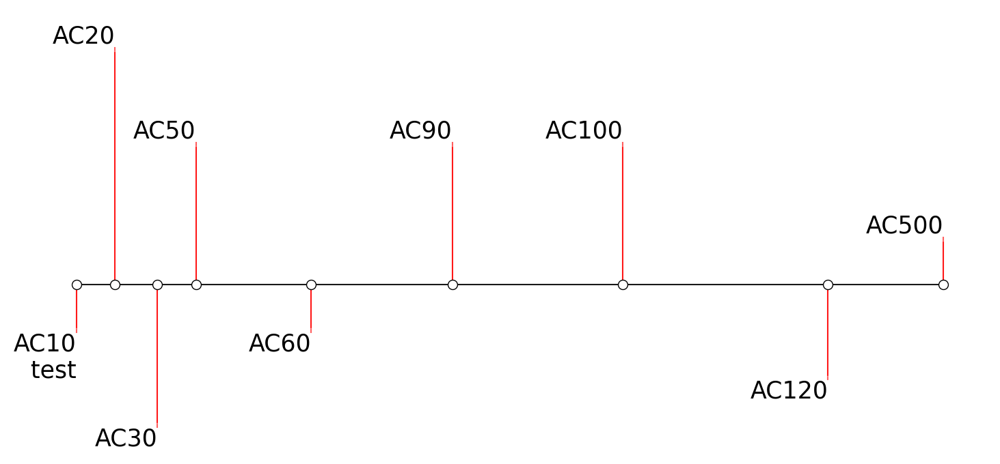

<div align="center">


<p>
  
</p>

<p>
  <a href="https://www.linkedin.com/in/piotr-parkitny"></a>
  <a href="mailto:piotr.parkitny@berkeley.edu"></a>
  <a href="https://github.com/pparkitn"></a>
  <a href="https://www.kaggle.com/dsptlp"></a>
</p>

<p>
  
  
  
  
</p>

</div>

---

## 🎯 About Me

```txt
┌────────────────────────────────────────────────────────────────┐
│  Senior Director leading AI Solutions & Platform Engineering   │
│  15+ years delivering ML systems from concept to production    │
│  I build AI solutions and the foundational layers they run on  │
│  MIDS @ UC Berkeley  ·  Eng Systems & Computing @ U of Guelph  │
│  Toronto, Canada                                                │
└────────────────────────────────────────────────────────────────┘
```

<table align="center">
<tr>
<td width="25%" align="center"><b>🧠 AI Solutions</b><br/><sub>End-to-end ML/DL products — NLP, CV, forecasting — shipped to real users</sub></td>
<td width="25%" align="center"><b>🏗 Platform Engineering</b><br/><sub>Foundational layers: data platforms, MLOps, edge inference, cloud infra</sub></td>
<td width="25%" align="center"><b>👥 Leadership</b><br/><sub>Director-level: strategy, hiring, roadmaps, cross-functional delivery</sub></td>
<td width="25%" align="center"><b>⚡ Scale</b><br/><sub>Spark · Databricks · Kafka on AWS/Azure — millions of events, HBOs of data</sub></td>
</tr>
</table>

---

## 🚀 Featured Projects

### 1. Face Emotion Detection → Edge Deployment

<a href="https://github.com/pparkitn/pparkitn/tree/main/proj1"></a>

**Real-time emotion recognition from live video** — deep neural network trained in the cloud, then compressed and deployed to an Nvidia Jetson for on-device inference.

- 🎯 *Challenge:* hitting real-time latency on edge hardware
- 🧱 **Stack:** `Python` `Docker` `AWS` `W&B` `MQTT`
- 📚 **Data:** FER-2013

[](https://github.com/pparkitn/pparkitn/tree/main/proj1)
[](https://www.kaggle.com/dsptlp/faceemotion-fer-2013)
[](https://www.kaggle.com/datasets/msambare/fer2013)

<br clear="right" />

---

### 2. Centralized Medical Data Platform

<a href="https://github.com/pparkitn/pparkitn/tree/main/data_engineering_1"></a>

**Petabyte-scale health-record repository** — streaming ingestion into a secure, centralized lake enabling advanced ML/DL at scale.

- 🎯 *Challenge:* HIPAA-grade security with streaming throughput
- 🧱 **Stack:** `Spark` `Kafka` `Flask` `Cloudera` `Presto` `Python`

[](https://github.com/pparkitn/pparkitn/blob/main/data_engineering_1/Presentation.pdf)
[](https://github.com/pparkitn/pparkitn/tree/main/data_engineering_1)

<br clear="left" />

---

### 3. MRI Analyzer — AI for Cancer Diagnosis

<a href="https://github.com/pparkitn/pparkitn/tree/main/proj2"></a>

**Automated prostate MRI & ultrasound analysis** helping medical professionals detect and diagnose cancer.

- 🎯 *Challenge:* end-to-end optimization for large medical imaging datasets
- 🧱 **Stack:** `Python` `PyTorch` `Docker` `AWS` `W&B`

[](https://github.com/pparkitn/pparkitn/tree/main/proj2)
[](https://www.kaggle.com/code/dsptlp/prostate-mri)

<br clear="right" />

---

### 4. Attractiveness Bias — A/B Test at Scale

<a href="https://github.com/pparkitn/pparkitn/tree/main/proj3"></a>

**Randomized controlled trial** exploring whether profile-photo attractiveness affects LinkedIn connection acceptance — behavioral bias in professional networks, measured.

- 🎯 *Challenge:* RCT design eliminating confounding factors
- 🧱 **Stack:** `R` `RCT` `Statistical Inference`

[](https://github.com/pparkitn/pparkitn/tree/main/proj3)
[](https://www.kaggle.com/code/dsptlp/attractiveness-bias-a-b-test)

<br clear="left" />

---

### 5. Counterfeit — Sentiment-Enhanced Summarization

<a href="https://github.com/pparkitn/pparkitn/tree/main/proj6"></a>

**Abstractive text summarization** improved by injecting sentiment signals into the model's attention — higher-quality summaries for opinion-heavy text.

- 🧱 **Stack:** `PyTorch` `NLP` `Attention`

[](https://github.com/pparkitn/pparkitn/blob/main/proj6/Final_Project_Piotr_Parkitny.pdf)
[](https://github.com/pparkitn/pparkitn/tree/main/proj6)

<br clear="right" />

---

### 6. YOLO — Object Detection in Video

**Real-time multi-object detection and tracking** in video streams using YoLo (You Only Look Once).

- 🧱 **Stack:** `PyTorch` `YOLO` `OpenCV`

[](https://www.kaggle.com/code/dsptlp/object-detection-using-yolo)

---

## 🧪 Research Portfolio

| Project | Domain | Techniques | Notebook | Kaggle |
|---------|--------|-----------|:--------:|:------:|
| [Clustering — KMeans + PCA](https://github.com/pparkitn/kaggle/blob/main/clustering-kmeans-with-pca.ipynb) | Unsupervised | Elbow method, PCA projection, k-means | [📓](https://github.com/pparkitn/kaggle/blob/main/clustering-kmeans-with-pca.ipynb) | [🔗](https://www.kaggle.com/code/dsptlp/clustering-kmeans-with-pca) |
| [Classification → SQL](https://github.com/pparkitn/kaggle/blob/main/classification.ipynb) | Supervised | Model training with production SQL scoring | [📓](https://github.com/pparkitn/kaggle/blob/main/classification.ipynb) | [🔗](https://www.kaggle.com/dsptlp/classificationtosql) |
| [LDA vs PCA](https://github.com/pparkitn/kaggle/blob/main/lda-vs-pca.ipynb) | Dimensionality | Supervised vs unsupervised projection, Iris | [📓](https://github.com/pparkitn/kaggle/blob/main/lda-vs-pca.ipynb) | [🔗](https://www.kaggle.com/code/dsptlp/lda-vs-pca) |
| [Stock Regression](https://github.com/pparkitn/kaggle/blob/main/us-stock-market-prediction-histdecision-trees.ipynb) | Time Series | Linear + gradient boosting regressors | [📓](https://github.com/pparkitn/kaggle/blob/main/us-stock-market-prediction-histdecision-trees.ipynb) | [🔗](https://www.kaggle.com/code/dsptlp/regression-with-timeline-data) |
| [Random Forest + SHAP](https://github.com/pparkitn/kaggle/blob/main/classification-random-forest.ipynb) | Explainable ML | CV, hyperparameter tuning, stratified folds, SHAP | [📓](https://github.com/pparkitn/kaggle/blob/main/classification-random-forest.ipynb) | [🔗](https://www.kaggle.com/code/dsptlp/classification-random-forest) |
| [Prophet — Canadian CPI](https://github.com/pparkitn/kaggle/blob/main/timeseries-forecast-using-prophet.ipynb) | Forecasting | Prophet with uncertainty intervals, inflation | [📓](https://github.com/pparkitn/kaggle/blob/main/timeseries-forecast-using-prophet.ipynb) | [🔗](https://www.kaggle.com/code/dsptlp/timeseries-forecast-using-prophet) |
| [Conversion A/B Curves](https://github.com/pparkitn/kaggle/blob/main/conversion-curve-a-b-test.ipynb) | Experimentation | Cumulative conversion, group comparison | [📓](https://github.com/pparkitn/kaggle/blob/main/conversion-curve-a-b-test.ipynb) | [🔗](https://www.kaggle.com/code/dsptlp/conversion-curve-a-b-test) |

---

## 📈 Visualization Gallery

| Visualization | Preview |
|:--------------|:-------:|
| Line Graph — Dual Y-Axis with annotations<br/><sub>[📓 notebook](https://github.com/pparkitn/kaggle/blob/main/line-graph-dual-y-axis.ipynb) · [🔗 kaggle](https://www.kaggle.com/code/dsptlp/line-graph-dual-y-axis)</sub> |  |
| Correlation Matrix<br/><sub>[📓 notebook](https://github.com/pparkitn/kaggle/blob/main/polar-examples.ipynb) · [🔗 kaggle](https://www.kaggle.com/code/dsptlp/polar-examples)</sub> |  |
| Feature Importance<br/><sub>[📓 notebook](https://github.com/pparkitn/kaggle/blob/main/polar-examples.ipynb) · [🔗 kaggle](https://www.kaggle.com/code/dsptlp/polar-examples)</sub> |  |
| CPI & Inflation Forecast<br/><sub>[📓 notebook](https://github.com/pparkitn/kaggle/blob/main/timeseries-forecast-using-prophet.ipynb) · [🔗 kaggle](https://www.kaggle.com/code/dsptlp/canada-consumer-price-index-forecast-using-prophet)</sub> |  |
| Timeline of Events<br/><sub>[📓 notebook](https://github.com/pparkitn/kaggle/blob/main/timelinegraph.ipynb) · [🔗 kaggle](https://www.kaggle.com/code/dsptlp/timelinegraph)</sub> |  |

<details>
<summary><b>More visualizations</b></summary>

| Visualization | Link |
|:--------------|-----:|
| Line Graph + Annotations | [📓](https://github.com/pparkitn/kaggle/blob/main/line-graph.ipynb) · [🔗](https://www.kaggle.com/code/dsptlp/line-graph) |
| Heatmap | [📓](https://github.com/pparkitn/kaggle/blob/main/heatmap.ipynb) · [🔗](https://www.kaggle.com/code/dsptlp/heatmap) |
| Bar Graph | [📓](https://github.com/pparkitn/kaggle/blob/main/bargraph.ipynb) · [🔗](https://www.kaggle.com/code/dsptlp/bargraph) |
| WordCloud | [📓](https://github.com/pparkitn/kaggle/blob/main/wordcloud.ipynb) · [🔗](https://www.kaggle.com/code/dsptlp/wordcloud) |
| Association Matrix (Categorical) | [📓](https://github.com/pparkitn/kaggle/blob/main/polar-examples.ipynb) · [🔗](https://www.kaggle.com/code/dsptlp/polar-examples) |

</details>

---

## 🧪 MLOps & Experiment Tracking

<table align="center">
<tr>
<td width="33%" align="center"><br/><sub>Experiment tracking, dataset & model versioning, registry</sub></td>
<td width="33%" align="center"><br/><sub>End-to-end MLOps: tracking, packaging, serving</sub></td>
<td width="33%" align="center"><br/><sub>Parameterized notebook execution & logging</sub></td>
</tr>
</table>

---

## 🔧 Data Engineering & Utilities

| Tool | Description | Link |
|------|-------------|------|
| **GPU Setup on Ubuntu** | NVIDIA drivers, CUDA, cuDNN — local GPU training environment | [📁](https://github.com/pparkitn/pparkitn/tree/main/nvidia_gpu_support) |
| **AWS Commands** | CLI reference for common cloud operations | [📄](https://github.com/pparkitn/pparkitn/blob/main/aws/README.md) |
| **Spark Patterns** | PySpark patterns for large-scale processing | [📄](https://github.com/pparkitn/pparkitn/blob/main/extra/spark.md) |
| **Papermill + Task Scheduler** | Automating notebook scoring pipelines on Windows Server | [📄](https://github.com/pparkitn/pparkitn/blob/main/extra/papermill.md) |

---

## 🏆 Kaggle & Open Data

- **[Free GPU Training Guide](https://github.com/pparkitn/pparkitn/tree/main/kaggle)** — 30+ hours of free GPU per week
- **[Creating Datasets on Kaggle](https://github.com/pparkitn/pparkitn/tree/main/kaggle_dataset)** — Versioned, shareable datasets
- **[FER-2013 Dataset](https://www.kaggle.com/datasets/msambare/fer2013)** — Facial expression recognition benchmark
- **[OpenML](https://www.openml.org/)** — Curated benchmark datasets

---

## 🎓 Education

| Degree | Institution | Focus |
|--------|-------------|-------|
|  **MIDS — UC Berkeley** | University of California, Berkeley | Statistical ML, Deep Learning, Systems at Scale |
|  **H.B.Sc Eng Systems & Computing** | University of Guelph | Control Systems, Signal Processing, Software Engineering |

---

## 🤝 Let's Connect

<p align="center">
  <a href="https://www.linkedin.com/in/piotr-parkitny">&nbsp;</a>
  <a href="mailto:piotr.parkitny@berkeley.edu">&nbsp;</a>
  <a href="https://github.com/pparkitn"></a>
</p>

<div align="center">
  
</div>

<p align="center">
  <sub>Built with 🧠 + ☕ • Toronto, Canada • Last updated: September 2026</sub>
</p>