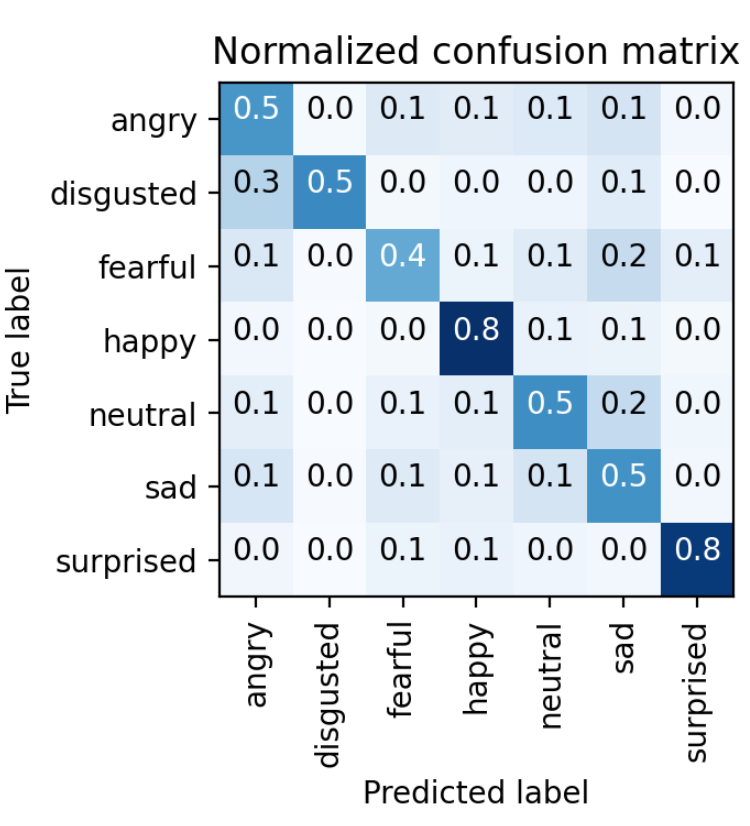

# Data Scientist 

Hey there, welcome to my data science playground on GitHub! I'm Piotr Parkitny, and I've been riding the data-driven wave for over 15 years, dropping knowledge bombs through analytics, machine learning, and all things data. 

## Education
- University of California, Berkeley — Master of Information and Data Science
- University of Guelph — H.B.Sc Engineering Systems and Computing

## About Me

- Location: Toronto, Canada
- Email: parkitn@berkeley.edu
- LinkedIn: https://www.linkedin.com/in/piotr-parkitny

## My Expertise
- Currently working as Senior Director of Analytics at SiriusXM Canada
- Specialized in:
  - Data Analysis 
  - Machine Learning 
  - Data Visualization 
  - Big Data Technologies 

## My Projects

Here are some of the projects I've worked on:

1. [Face Emotion Detection](proj1/README.md)
   - Description: Detecting emotion based on facial expression from a live video feed.
   - Technologies Used: Python, Docker, Amazon AWS, W&B, MQTT
   - Highlights: Training the DNN in the Cloud and deploying it to the Nvidia Jetson
  

    

  
  

    

2. [MRI ANALYZER](proj2/README.md)
   - Description: Helping medical professionals identify and diagnose cancer.
   - Technologies Used: Python, PyTorch, Docker, Amazon AWS, W&B, 
   - Highlights: End to end pipeline for cancer diagnosis
