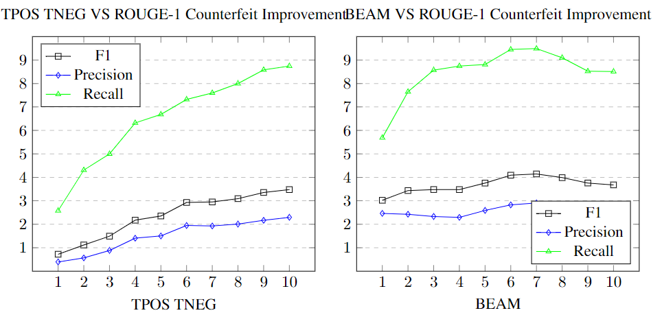

# Data Jedi Master

Hey there, welcome to my data science playground on GitHub! I'm Piotr Parkitny, and I've been riding the data-driven wave for over 15 years, dropping knowledge bombs through analytics, machine learning, and all things data. 

- Programming Languages: Python, SQL, R
- Big Data Platforms: Databricks, Spark
- Data Analysis: SQL, Pandas, NumPy

## Education
-  University of California, Berkeley — Master of Information and Data Science
-  University of Guelph — H.B.Sc Engineering Systems and Computing

## About Me

- Location: Toronto, Canada
- Email: parkitn@berkeley.edu
- LinkedIn: https://www.linkedin.com/in/piotr-parkitny

## Projects

Here are some of the projects I've worked on:

1. [Face Emotion Detection](proj1/README.md)
   - Description: Detecting emotion based on facial expression from a live video feed.
   - Technologies Used: Python, Docker, Amazon AWS, W&B, MQTT
   - Highlights: Training the DNN in the Cloud and deploying it to the Nvidia Jetson
   - Try it on [Kaggle FaceEmotion](https://www.kaggle.com/dsptlp/faceemotion-fer-2013)
  

    

  
  

2. [MRI ANALYZER](proj2/README.md)
   - Description: Helping medical professionals identify and diagnose cancer.
   - Technologies Used: Python, PyTorch, Docker, Amazon AWS, W&B, 
   - Highlights: End-to-end pipeline for cancer diagnosis

    
  

3. [Attractiveness Bias](proj3/Final_Presentation.pdf)
   - Description: Does attractiveness play a role in accepting a connection from a stranger in LinkedIn?
   - Technologies Used: R
   - Highlights: RCT conducted on LinkedIn 

      

4. [Coming Soon - Human Pose Estimation](proj4/README.md)
   - Description: Tracking human pose for rock climbing style comparison
   - Technologies Used: Python / CV2
   
   

      
   

5. [Coming Soon - Spark - Time Series Prediction](proj5/README.md)
   - Description: Building large window feature set used for predicting future
   - Technologies Used: Spark / Python

6. [Counterfeit: Sentiment Improved Text Summarization](proj6/Final_Project_Piotr_Parkitny.pdf)
   - Description: NLP Text summarization model that uses sentiment for text preprocessing
   - Technologies Used: PyTorch

   

      
   

## Machine Learning

Here are some examples of machine learning using python:

1. [Clustering](https://github.com/pparkitn/kaggle/blob/main/clustering-kmeans-with-pca.ipynb)
   - Description: Clustering using Kmeans with PCA for graphing
   - Try it on [Kaggle Clustering](https://www.kaggle.com/code/dsptlp/clustering-kmeans-with-pca)
  

    
    

2. [Model Performance Tracking](https://wandb.ai/)
   - Description: Weights & Biases helps AI developers build better models faster. Quickly track experiments, version and iterate on datasets, evaluate model performance, reproduce models, and manage your ML workflows end-to-end. 

    

## Data Engineering Examples

1. [Centralized Repository of Medical Data](data_engineering_1/Presentation.pdf)
   - Description: Compiling large, up-to-date, secure and centralized repositories of health records is a major challenge facing medical data science. Achieving this will allow advanced ML/DL techniques to be applied to sufficiently large datasets for optimal performance and impact
   - Technologies Used: Spark, Flask, Kafka, Python, Cloudera, Presto
   
   

      
   

## Charts / Graphs

1. [Line Graph](https://github.com/pparkitn/kaggle/blob/main/line-graph.ipynb)
   - Seaborn Line Graph with annotations
   - Try it on [Kaggle](https://www.kaggle.com/dsptlp/line-graph)

    

2. [Line Graph - Dual Y Axis](https://github.com/pparkitn/kaggle/blob/main/line-graph-dual-y-axis.ipynb)
   - Seaborn Line Graph with annotations and two y-axis
   - Try it on [Kaggle](https://www.kaggle.com/dsptlp/line-graph-dual-y-axis)

    

3. [HeatMap](https://github.com/pparkitn/kaggle/blob/main/heatmap.ipynb)
   - Seaborn Heat Map with annotations
   - Try it on [Kaggle](https://www.kaggle.com/code/dsptlp/heatmap)

    

4. [BarGraph](https://github.com/pparkitn/kaggle/blob/main/bargraph.ipynb)
   - Seaborn Bar Graph
   - Try it on [Kaggle](https://www.kaggle.com/code/dsptlp/bargraph)   

    

5. [WordCloud](https://github.com/pparkitn/kaggle/blob/main/polar-examples.ipynb)
   - WordCloud using text from Canada Wiki Page
   - Try it on [Kaggle](https://www.kaggle.com/dsptlp/wordcloud)   

    

6. [Correlation](https://github.com/pparkitn/kaggle/blob/main/polar-examples.ipynb)
   - Correlation Matrix using Seaborn
   - Try it on [Kaggle](https://www.kaggle.com/dsptlp/polar-examples)

    

7. [Association](https://github.com/pparkitn/kaggle/blob/main/polar-examples.ipynb)
   - Association Matrix using Seaborn (Includes Categorical Features)
   - Try it on [Kaggle](https://www.kaggle.com/dsptlp/polar-examples)   

    

8. [Important Features](https://github.com/pparkitn/kaggle/blob/main/polar-examples.ipynb)
   - Important Features in a Dataset that have impact on target
   - Try it on [Kaggle](https://www.kaggle.com/dsptlp/polar-examples)   

    

## Other
1. [GPU Support Setup - Local Computer](nvidia_gpu_support/readme.md)
   - Setting up GPU support on Ubuntu for GPU Training

2. [DataSets - OpenML](https://www.openml.org/)
   - Great source if looking for a dataset to work with

## Kaggle
1. [Kaggle - Free GPU Training](kaggle/README.md)
   - GPU Training for free on Kaggle
2. [Kaggle - Create a DataSet](kaggle_dataset/README.md)
   - Store Data on Kaggle for Free

