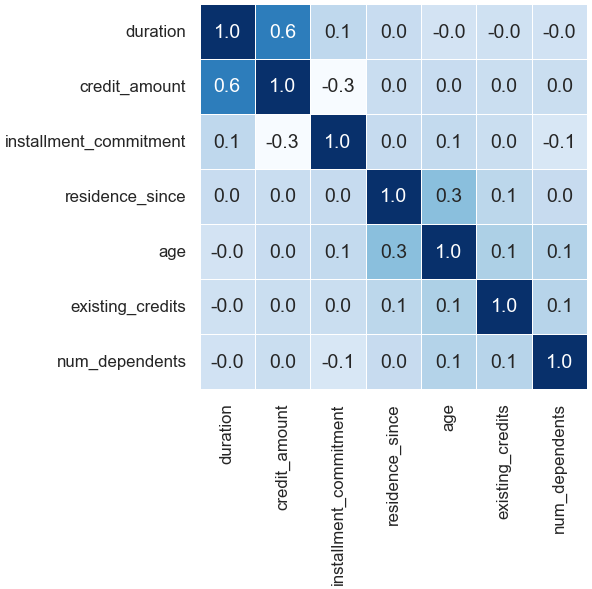

# Data Jedi Master

Hey there, welcome to my data science playground on GitHub! I'm Piotr Parkitny, and I've been riding the data-driven wave for over 15 years, dropping knowledge bombs through analytics, machine learning, and all things data. 

## Education
- University of California, Berkeley — Master of Information and Data Science
- University of Guelph — H.B.Sc Engineering Systems and Computing

## About Me

- Location: Toronto, Canada
- Email: parkitn@berkeley.edu
- LinkedIn: https://www.linkedin.com/in/piotr-parkitny

## My Projects

Here are some of the projects I've worked on:

1. [Face Emotion Detection](proj1/README.md)
   - Description: Detecting emotion based on facial expression from a live video feed.
   - Technologies Used: Python, Docker, Amazon AWS, W&B, MQTT
   - Highlights: Training the DNN in the Cloud and deploying it to the Nvidia Jetson
   - Try it on [Kaggle FaceEmotion](https://www.kaggle.com/dsptlp/faceemotion-fer-2013)
  

    

  
  

2. [MRI ANALYZER](proj2/README.md)
   - Description: Helping medical professionals identify and diagnose cancer.
   - Technologies Used: Python, PyTorch, Docker, Amazon AWS, W&B, 
   - Highlights: End-to-end pipeline for cancer diagnosis

    
  

## Visualisations

1. [Line Graph](graph_examples/1_Graph_Example_1.ipynb)
   - Seaborn Line Graph with annotations

    

2. [Line Graph - Dual Y Axis](graph_examples/1_Graph_Example_2.ipynb)
   - Seaborn Line Graph with annotations and two y-axis

    

3. [HeatMap](graph_examples/1_Graph_Example_3.ipynb)
   - Seaborn Heat Map with annotations

    

4. [BarGrah](graph_examples/1_Graph_Example_4.ipynb)
   - Seaborn Bar Graph

    

5. [WordCloud](graph_examples/1_Graph_Example_5.ipynb)
   - WordCloud using text from Canada Wiki Page

    

6. [Correlation](graph_examples/1_Graph_Example_6.ipynb)
   - Correlation Matrix using Seaborn

    

7. [Association](graph_examples/1_Graph_Example_6.ipynb)
   - Association Matrix using Seaborn (Includes Categorical Features)

    

8. [Important Features](graph_examples/1_Graph_Example_6.ipynb)
   - Important Features in a Dataset that have impact on target

    

## Other
1. [GPU Support Setup - Local Computer](nvidia_gpu_support/readme.md)
   - Setting up GPU support on Ubuntu for GPU Training

## Kaggle
1. [Kaggle - Free GPU Training](kaggle/README.md)
   - GPU Training for free on Kaggle
2. [Kaggle - Create a DataSet](kaggle_dataset/README.md)
   - Store Data on Kaggle for Free

