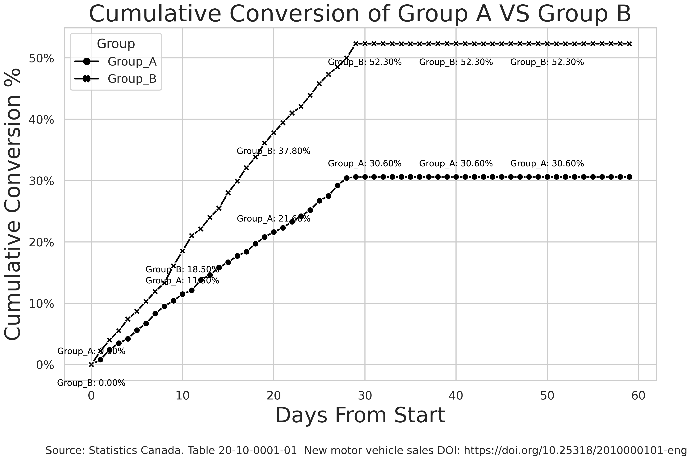
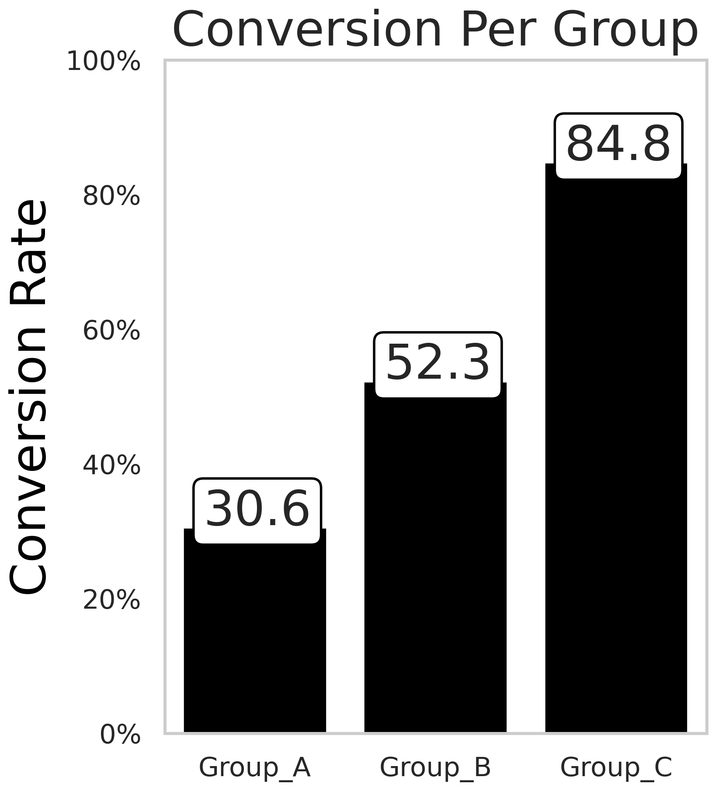

# Data Jedi Master

Welcome to my data science playground on GitHub!
I'm Piotr Parkitny, and I've been harnessing the power of data for over 15 years. Through advanced analytics, machine learning, and AI, I've helped businesses and teams drive strategic decisions and actionable insights. Here you'll find some of my favorite projects and research.

- Programming Languages: Python, SQL, R
- Big Data Platforms: Databricks, Spark
- Data Analysis Tools: SQL, Pandas, NumPy, Seaborn

## Education
-  University of California, Berkeley — Master of Information and Data Science
-  University of Guelph — H.B.Sc Engineering Systems and Computing

## About Me

- Location: Toronto, Canada
- Email: pparkitny@berkeley.edu
- LinkedIn: https://www.linkedin.com/in/piotr-parkitny

## Projects

Here are some of the projects I've worked on:

1. [Face Emotion Detection](proj1/README.md)
<br>Using deep learning to recognize human emotions from live video streams
   - Technologies : Python, Docker, Amazon AWS, W&B, MQTT
   - Dataset: [FER-2013](https://www.kaggle.com/datasets/msambare/fer2013)
   - Highlights: Training the DNN in the Cloud and deploying it to the Nvidia Jetson
   - Challenge: Optimizing the deployment for real-time performance on edge devices
   - Highlights: Achieved cloud training and deployed a deep neural network to edge hardware
   - Try it on [Kaggle FaceEmotion](https://www.kaggle.com/dsptlp/faceemotion-fer-2013)
  
<p align="center">
    
</p>

<p align="center">
  
  
</p>

2. [MRI ANALYZER](proj2/README.md)
<br>Helping medical professionals identify and diagnose cancer with AI.
   - Technologies : Python, PyTorch, Docker, Amazon AWS, W&B, 
   - Challenge: End-to-end optimization of the AI pipeline for handling large medical image datasets
   - Highlights: Implemented a fully automated pipeline for MRI analysis
   - Try it on [Kaggle](https://www.kaggle.com/code/dsptlp/prostate-mri)

<p align="center">
    
  
</p>

3. [Attractiveness Bias](proj3/Final_Presentation.pdf)
<br>Exploring whether attractiveness affects LinkedIn connection acceptance.
   - Technologies Used: R   
   - Impact: A/B test conducted across LinkedIn profiles, providing insights into human behavioral bias in online connections
   - Challenge: Designing a randomized controlled trial to eliminate confounding factors.
   - Try it on [Kaggle](https://www.kaggle.com/code/dsptlp/attractiveness-bias-a-b-test)

<p align="center">
      
</p>

4. [Coming Soon - Human Pose Estimation](proj4/README.md)
   - Description: Tracking human pose for rock climbing style comparison
   - Technologies Used: Python / CV2
   
   <p align="center">
      
   </p>

6. [Counterfeit: Sentiment Improved Text Summarization](proj6/Final_Project_Piotr_Parkitny.pdf)
<br>Improving NLP text summarization by incorporating sentiment analysis.
   - Technologies Used: PyTorch

   <p align="center">
      
   </p>

## Forecasting

1. [Forecasting using Prophet](https://github.com/pparkitn/kaggle/blob/main/timeseries-forecast-using-prophet.ipynb)
   - Description: Forecasting the Canadian Price Index using Prophet
   - Try it on [Kaggle](https://www.kaggle.com/code/dsptlp/timeseries-forecast-using-prophet)

   <p align="center">
      
   </p>


2. [Coming Soon - Spark - Time Series Prediction](proj5/README.md)
   - Description: Building large window feature set used for predicting future
   - Technologies Used: Spark / Python


## Machine Learning

Here are some examples of machine learning using python:

1. [Clustering](https://github.com/pparkitn/kaggle/blob/main/clustering-kmeans-with-pca.ipynb)
   - Description: Clustering using Kmeans with PCA for graphing
   - Try it on [Kaggle](https://www.kaggle.com/code/dsptlp/clustering-kmeans-with-pca)
  
<p align="center">
    
    
</p>

2. [Classification](https://github.com/pparkitn/kaggle/blob/main/classification.ipynb)
   - Description: Classification with the final result implementation in SQL
   - Try it on [Kaggle](https://www.kaggle.com/dsptlp/classificationtosql)

<p align="center">
    
</p>   
  
3. [Model Performance Tracking](https://wandb.ai/)
   - Description: Weights & Biases helps AI developers build better models faster. Quickly track experiments, version and iterate on datasets, evaluate model performance, reproduce models, and manage your ML workflows end-to-end. 

<p align="center">
    
</p>

4. [LDA VS PCA](https://github.com/pparkitn/kaggle/blob/main/lda-vs-pca.ipynb)
   - Description: Comparison of LDA and PCA 2D projection of Iris dataset
   - Try it on [Kaggle](https://www.kaggle.com/code/dsptlp/lda-vs-pca)
<p align="center">
    
    
</p>

5. [Regression](https://github.com/pparkitn/kaggle/blob/main/us-stock-market-prediction-histdecision-trees.ipynb)
   - Description: Using regression to predict next day stock market price based on historical price of stock prices
   - Try it on [Kaggle](https://www.kaggle.com/code/dsptlp/regression-with-timeline-data)
<p align="center">
    
    
</p>   

6. [Classification - Random Forest](https://github.com/pparkitn/kaggle/blob/main/classification-random-forest.ipynb)
   - Description: Random Forest Classification with Cross-Validation / Hyperparameter Tuning / Stratified Fold & SHAP Analysis
   - Try it on [Kaggle](https://www.kaggle.com/code/dsptlp/classification-random-forest) 

<p align="center">
    
</p>   

## Computer Vision

1. [Object Detection in Video](https://www.kaggle.com/code/dsptlp/object-detection-using-yolo)
   - Description: Object Detection Using YoLo (You Only Look Once) in videos.
   - Try it on [Kaggle](https://www.kaggle.com/code/dsptlp/object-detection-using-yolo)

<p align="center">
    
    
    
</p>  


## Experiment Tracking

1. [Cumulative Conversion](https://github.com/pparkitn/kaggle/blob/main/conversion-curve-a-b-test.ipynb)
   - Description: Graphing performance of different groups over time
   - Try it on [Kaggle](https://www.kaggle.com/code/dsptlp/conversion-curve-a-b-test)

<p align="center">
    
    
</p>

## Data Engineering Examples

1. [Centralized Repository of Medical Data](data_engineering_1/Presentation.pdf)
   - Description: Compiling large, up-to-date, secure and centralized repositories of health records is a major challenge facing medical data science. Achieving this will allow advanced ML/DL techniques to be applied to sufficiently large datasets for optimal performance and impact
   - Technologies Used: Spark, Flask, Kafka, Python, Cloudera, Presto
   
   <p align="center">
      
   </p>

2. [ML Execution - Windows Server](https://github.com/pparkitn/pparkitn/blob/main/extra/papermill.md)
   - Description: How to execute your python notebook and log execution
   - Technologies Used: Python, papermill

Running Parameterized Jupyter Notebooks
Installation
```
pip install papermill
```

Execute_ScoreModel.bat
   ```
@ECHO OFF 

set _my_datetime=%date%_%time%
set _my_datetime=%_my_datetime: =_%
set _my_datetime=%_my_datetime::=%
set _my_datetime=%_my_datetime:/=_%
set _my_datetime=%_my_datetime:.=_%

ECHO ======================================================================================================================
echo %_my_datetime%
ECHO ======================================================================================================================

C:\Users\piotr\AppData\Roaming\Python\Python311\Scripts\papermill.exe C:\Models\Score.ipynb -p par1 0 C:\Models\Log\Score_Log_%_my_datetime%.ipynb
```
When scheduling using task scheduler, add arguments to track the shell log execution
```C:\Models\log.txt 2>&1```

3. [MLflow](https://mlflow.org/docs/latest/getting-started/intro-quickstart/index.html)
   - Description: Build better models and generative AI apps on a unified, end-to-end,open source MLOps platform
   - Technologies Used: Python, MLflow

## Charts / Graphs

1. [Line Graph](https://github.com/pparkitn/kaggle/blob/main/line-graph.ipynb)
   - Seaborn Line Graph with annotations
   - Try it on [Kaggle](https://www.kaggle.com/dsptlp/line-graph)
<p align="center">
    
</p>

2. [Line Graph - Dual Y Axis](https://github.com/pparkitn/kaggle/blob/main/line-graph-dual-y-axis.ipynb)
   - Seaborn Line Graph with annotations and two y-axis
   - Try it on [Kaggle](https://www.kaggle.com/dsptlp/line-graph-dual-y-axis)
<p align="center">
    
</p>

3. [HeatMap](https://github.com/pparkitn/kaggle/blob/main/heatmap.ipynb)
   - Seaborn Heat Map with annotations
   - Try it on [Kaggle](https://www.kaggle.com/code/dsptlp/heatmap)
<p align="center">
    
</p>

4. [BarGraph](https://github.com/pparkitn/kaggle/blob/main/bargraph.ipynb)
   - Seaborn Bar Graph
   - Try it on [Kaggle](https://www.kaggle.com/code/dsptlp/bargraph)   
<p align="center">
    
</p>

5. [WordCloud](https://github.com/pparkitn/kaggle/blob/main/wordcloud.ipynb)
   - WordCloud using text from Canada Wiki Page
   - Try it on [Kaggle](https://www.kaggle.com/dsptlp/wordcloud)   
<p align="center">
    
</p>

6. [Correlation](https://github.com/pparkitn/kaggle/blob/main/polar-examples.ipynb)
   - Correlation Matrix using Seaborn
   - Try it on [Kaggle](https://www.kaggle.com/dsptlp/polar-examples)
<p align="center">
    
</p>

7. [Association](https://github.com/pparkitn/kaggle/blob/main/polar-examples.ipynb)
   - Association Matrix using Seaborn (Includes Categorical Features)
   - Try it on [Kaggle](https://www.kaggle.com/dsptlp/polar-examples)   
<p align="center">
    
</p>

8. [Important Features](https://github.com/pparkitn/kaggle/blob/main/polar-examples.ipynb)
   - Important Features in a Dataset that have impact on target
   - Try it on [Kaggle](https://www.kaggle.com/dsptlp/polar-examples)   
<p align="center">
    
</p>

9. [Timeline of Events](https://github.com/pparkitn/kaggle/blob/main/timelinegraph.ipynb)
   - Simple Timeline of events graph
   - Try it on [Kaggle](https://www.kaggle.com/code/dsptlp/timelinegraph)   
<p align="center">
    
</p>

10. [Canada Inflation & CPI](https://github.com/pparkitn/kaggle/blob/main/timeseries-forecast-using-prophet.ipynb)
   - Graphing and Forecasting CPI and Inflation
   - Try it on [Kaggle](https://www.kaggle.com/code/dsptlp/canada-consumer-price-index-forecast-using-prophet)   
<p align="center">
    
</p>

## Other
1. [GPU Support Setup - Local Computer](nvidia_gpu_support/readme.md)
   - Setting up GPU support on Ubuntu for GPU Training

2. [DataSets - OpenML](https://www.openml.org/)
   - Great source if looking for a dataset to work with

3. [AWS - Commands](https://github.com/pparkitn/pparkitn/blob/main/aws/README.md)
   - General AWS Commands

4. [Spark](https://github.com/pparkitn/pparkitn/blob/main/extra/spark.md)
   - General Spark Python

5. Jupyterlab
   - ```jupyter lab --port 3939 --allow-root --no-browser --NotebookApp.token='pass' --ip="0.0.0.0"```

6. MFFlow
   - ```mlflow server --host 127.0.0.1 --port 8080```

## Kaggle
1. [Kaggle - Free GPU Training](kaggle/README.md)
   - GPU Training for free on Kaggle
2. [Kaggle - Create a DataSet](kaggle_dataset/README.md)
   - Store Data on Kaggle for Free


