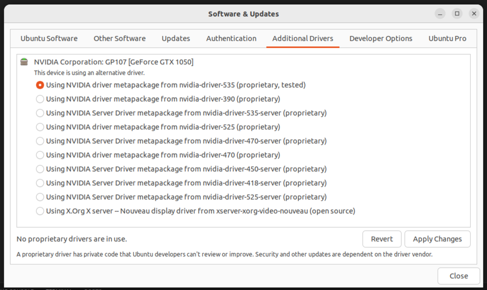

# Adding NVIDIA GPU Support for PyTorch on Ubuntu

This guide will help you set up NVIDIA GPU support on Ubuntu to run PyTorch with GPU acceleration.

## 1. Check Your GPU

Open a terminal and verify that you have an NVIDIA GPU installed in your machine:

```
lspci | grep -i nvidia
```

This should display information about your NVIDIA GPU.

## 2. Install NVIDIA Drivers

```
sudo apt update
sudo apt install nvidia-driver-XXX
sudo reboot
```

Replace XXX with the version number of the driver recommended for your GPU. You can find the recommended driver version on the NVIDIA website or by using the Ubuntu "Additional Drivers" utility.

<p align="center">  
  
</p>


## 3.  Install PyTorch with GPU Support
```
pip install torch torchvision torchaudio
```
PyTorch should automatically detect and utilize your NVIDIA GPU when it's available.

## 4. Verify GPU Support

```
import torch

# Check if a GPU is available
if torch.cuda.is_available():
    # Print the name of the GPU
    print(torch.cuda.get_device_name(0))
else:
    print("No GPU available, using CPU.")
```

This code will print the name of your GPU if it's correctly configured and available.

That's it! You should now have NVIDIA GPU support enabled for PyTorch on your Ubuntu machine. You can use PyTorch to train and run deep learning models with GPU acceleration.
