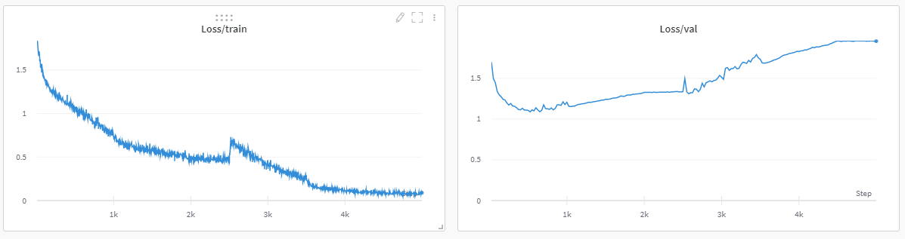
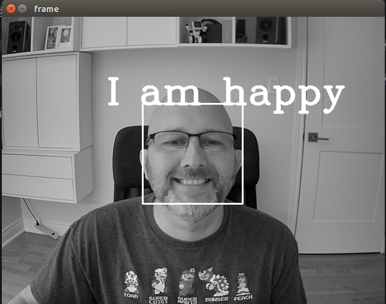

<p align="center">
  <p align="center"><strong>Face Emotion Detection</strong></p>
  <p align="center"><strong>Piotr Parkitny | pparkitny@ischool.berkeley.edu</strong></p>
</p>

<!-- TABLE OF CONTENTS -->
## Table of Contents

* [Problem Statement](#problem-statement)
* [Dataset](#dataset)
* [Project Solution](#project-solution)
* [Cloud Training](#cloud-training)
* [Edge Inference](#edge-inference)
* [Dashboard](#Dashboard)
* [Results](#results)
* [Future Work](#future-work)

<!-- PROBLEM STATEMENT -->
## Problem Statement

Detecting emotion from an image has many applications, Some examples of automatically analyzing video to determine how people reacted to certain events:
- Zoom transcript along with facial emotion
- Focus groups/comedy show: timing detected emotion with the treatment
- Determine how happy a film/TV show is based on the actor's emotions. 
- Pick the best pictures to showcase from your photo album

A full presentation is available here --> <a href="https://docs.google.com/presentation/d/1Ad-MFVl7flxIrB0UWxRSKS_G0U72Mb6mAy9TeSaRZD0/edit?usp=sharing" title="Presentation">Presentation</a>

<!-- DATASET -->
## Dataset

The dataset is composed of human faces labeled according to the displayed emotion.

<p align="center">
    
</p>

- FER - 2013
- 36k examples of 48x48 greyscale images of faces
- 140 MB
- Emotions: happy, sad, fearful, angry, neutral, surprised, and disgusted


<!-- PROJECT SOLUTION -->
## Project Solution

The diagram below describes the overall solution.    
The solution is broken down into Cloud and Edge components.

<p align="center">
    
</p>

## Cloud Components
Cloud is composed of Amazon AWS and Google GCP that are used for training, storing results, and displaying real-time results from the Edge device
1. Training      
The model that is used on Amazon AWS for training on the dataset --> [Model](cloud/Model_V4.ipynb)
2. BigQuery  
The Google GCP-hosted database that stores real-time input data from the Edge device.
2. DataStudio     
Datastudio dashboard hosted on Google GCP for displaying data from BigQuery 

## Edge Device
Jetson is used as the edge device for running the model
1. MQTT Broker --> [edge-MQTT-broker](edge-MQTT-broker/).
The Edge MQTT broker stores the detected facial emotion.
2. MQTT Forwarder --> [edge-MQTT-forwarder](edge-MQTT-forwarder/).
The Edge MQTT Forwarder subscribes to the local MQTT Broker and publishes to the cloud DB.
3. Face Detector --> [edge-emotion-detector](edge-face-emotion/).
The Edge Face Detector detects the facial emotion and publishes it to the local MQTT Broker.

<!-- CLOUD TRAINING -->
## Cloud Training
------------
Training is done on Amazon AWS EC2 using g4dn.xlarge instance. Below are the steps required to set up training
- Start Amazon VM and SSH into the box

```
ssh -i us-east-1-jetson.pem -L 7777:127.0.0.1:7777 ubuntu@ec2-34-238-51-68.compute-1.amazonaws.com 
```

### Start Docker and JupyterLab
- After starting docker open the notebook and run file --> [cloud-train](cloud/Model_V4.ipynb). 
- At each epoch the model is saved to S3 bucket so it can be pulled down by the edge device.

```
docker run --privileged --shm-size=1g --ulimit memlock=-1 --ipc=host --net=host --gpus all -it -v $(pwd):/workspace nvcr.io/nvidia/pytorch:21.06-py3
jupyter-lab --ip=0.0.0.0 --port 7777 --allow-root --no-browser --NotebookApp.token=''
```

### Weights & Biases
Weights & Biases is used for tracking the progress of the training along with keeping all the results saved.   
Below are an example of the generated graphs.

<p align="center">
    
</p>

<p align="center">
    
</p>

<p align="center">
    
</p>


<!-- Edge Inference-->
## Edge Inference
------------
Running on the edge is done on the Jetson, the following code will start the process.

Start Broker
```
cd edge-MQTT-broker
./start.sh
```

Start Forwarder
```
cd edge-MQTT-forwarder
./start.sh
```

Start Face Emotion Detector
```
sudo xrandr --fb 1900x1000
xhost +
cd edge-face-detect
start.sh
python3 emotion_detect.py
```

Below are some images that are based on running on the Jetson. No noticeable lag can be observed and the overall performance is very good.

<p align="center">
    
    
  
</p>

<p align="center">
    
</p>

<p align="center">
    
</p>

<!-- DASHBOARD -->
### Dashboard
------------
Online dashbaord can be viewed by using the following link --> <a href="https://datastudio.google.com/s/ndSXN4vrk7M" title="Dashboard">DataStudio Dashboard</a>   
The dashboard pulls the data from bigquery that is used by MQTT Fowarder to store emotions along with a timestamp.

<p align="center">
    
</p>

<!-- RESULTS -->
### Results
------------
- Very good results classifying happy and surprised
- Angry, disgusted, and fearful show very low performance
- Acc1 = 62.5 %


<p align="center">
    
</p>

<p align="center">
    
</p>

<p align="center">
    
</p>

<p align="center">
    
</p>
