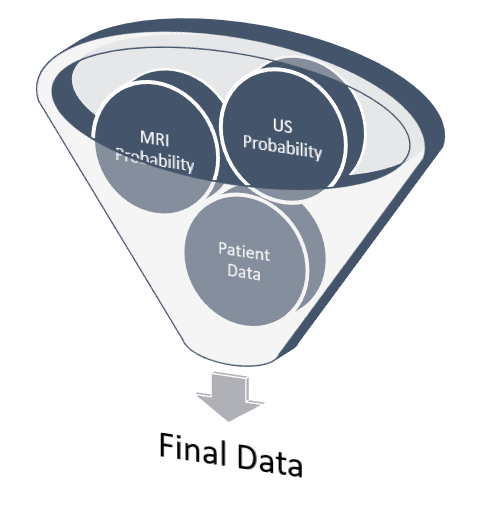

  
<strong>MRI ANALYZER</strong>

  
<strong>Piotr Parkitny | pparkitny@berkeley.edu</strong>

  
<strong>Aidan Jackson | aidanjackson@berkeley.edu</strong>

  
<strong>Dhyani Parekh | dhyanip7@berkeley.edu</strong>

  
<strong>Candice Sener | senercansu@berkeley.edu</strong>

<!-- TABLE OF CONTENTS -->
## Table of Contents

* [Problem Statement](#problem-statement)
* [Dataset](#dataset)
* [Pipeline Journey](#pipeline-journey)
* [Pipeline Journey](#pipeline-journey)

<!-- PROBLEM STATEMENT -->
## Problem Statement

The MRI Analyzer team’s mission is to aid medical professionals when identifying prostate cancer and determining the best course of follow-up actions. 
MRI Analyzer offers flexibility to patients who only have a partial data record available, qualifies its predictions with uncertainty estimates at each step, and matches in-practice metrics of cancer diagnosis. 
This has the ability to increase the speed with which readings can be performed while maintaining performance and usefulness in a variety of healthcare scenarios.

<!-- DATASET -->
## Dataset

From the National Cancer Institute’s Image Data Commons archive, we obtained the dataset titled Prostate MRI and Ultrasound With Pathology and Coordinates of Tracked Biopsy (Prostate-MRI-US-Biopsy). 

    
  

### Summary of Dataset
This dataset was derived from tracked biopsy sessions using the Artemis biopsy system, many of which included image fusion with MRI targets. Patients received a 3D transrectal ultrasound scan, after which nonrigid registration (e.g. “fusion”) was performed between real-time ultrasound and preoperative MRI, enabling biopsy cores to be sampled from MR regions of interest. Most cases also included a sampling of systematic biopsy cores using a 12-core digital template. The Artemis system tracked targeted and systematic core locations using encoder kinematics of a mechanical arm, and recorded locations relative to the Ultrasound scan. MRI biopsy coordinates were also recorded for most cases. STL files and biopsy overlays are available and can be visualized in 3D Slicer with the SlicerHeart extension.  Spreadsheets summarizing biopsy and MR target data are also available. See the Detailed Description tab below for more information.

MRI targets were defined using multiparametric MRI, e.g. t2-weighted, diffusion-weighted, and perfusion-weighted sequences, and scored on a Likert-like scale with close correspondence to PIRADS version 2. t2-weighted MRI was used to trace ROI contours, and is the only sequence provided in this dataset. MR imaging was performed on a 3 Tesla Trio, Verio, or Skyra scanner (Siemens, Erlangen, Germany). A transabdominal phased array was used in all cases, and an endorectal coil was used in a subset of cases. The majority of pulse sequences are 3D T2:SPC, with TR/TE 2200/203, Matrix/FOV 256 × 205/14 × 14 cm, and 1.5mm slice spacing. Some cases were instead 3D T2:TSE with TR/TE 3800–5040/101, and a small minority were imported from other institutions (various T2 protocols.)

Ultrasound scans were performed with Hitachi Hi-Vision 5500 7.5 MHz or the Noblus C41V 2-10 MHz end-fire probe. 3D scans were acquired by rotation of the end-fire probe 200 degrees about its axis, and interpolating to resample the volume with isotropic resolution.

Patients with suspicion of prostate cancer due to elevated PSA and/or suspicious imaging findings were consecutively accrued. Any consented patient who underwent or had planned to receive a routine, standard-of-care prostate biopsy at the UCLA Clark Urology Center was included.  

### Data Schema
While the original dataset had anonymized health information for over 1,000 patients, it was distributed across several files and sources. Key to joining the correct information was a unique Patient Identifier assigned to each record.

  

### Data Source Files
- Images DICOM 77GB (67K files)
- Target Data (XLSX) 131 (KB)
- Biopsy Data (XLSX) 4.25 (MB)
- STL Files (ZIP) 274 (MB)
- Biopsy Overlays (ZIP) 333 (MB)

### EDA

    
    

  

### Target Feature: Cancerous Percentage of Biopsy
While several parts of the dataset related to patient diagnostics, such as their medical scans or blood tests, even more important was their outcomes related to cancer. The dataset did not indicate directly whether a patient received a diagnosis of prostate cancer or its severity. Rather, it had information relating to the amount and score of cancer found during biopsy. In order to generate a useful set of target labels for supervised training, a patient was labeled as “cancerous” if any of their biopsies had a percentage of cancer greater than zero.

  

### PSA Blood Concentration in nanograms per milliliter 
PSA is a protein produced by the prostate in both healthy and cancerous individuals. In many cases, a blood test measuring PSA concentration will be the first line of prostate cancer detection. It is thought that prostate cancer leads to higher PSA production and thus concentration in the blood, but its use as a screening procedure is often interchanged with the digital rectal exam.

    

<!-- PIPELINE JOURNEY -->
## Pipeline Journey

### Project Environment
The environment used to create and run the algorithms for the MRI Analyzer are on the public cloud- Amazon Web Services. We are running an EC2 instance and within that running the Deep Learning for Ubuntu operating system. Within that, the docker image is based on NVIDIA for PyTorch. The results and dataset are stored in an S3 bucket and we utilized Papermill to run our models.

    

### Data Pipeline
The two key types of information contained for each patient were their medical images, used for the DNN models like ResNet, and other metadata, used for downstream tasks.

    

### Modeling Steps

#### 1. PROCESS DICOM
##### MRI 
- Extract images from MRI DICOM files (multiple)
- Crop image to zoom in on prostate
- Only keep 25 images that are extracted from the middle of the scan
- The resulting image is a 5×5 image grid with a final resolution of 720×720

##### Ultrasound
- Extract images from the MRI DICOM file (only one)
- Crop image to zoom in on prostate
- Only keep 25 images that are extracted from the middle of the scan
- The resulting image is a 5×5 image grid with a final resolution of 1220×1220

  

    
  

#### 2. DATA SET CREATOR
Once the transformations of the primary features, i.e. medical images, were decided upon they were implemented for the entire dataset. Given that these images were ~70 GB originally, efficient motivation and use of these transformations were required to add value while not creating unnecessary labor.

Each image is classified as Pos or Neg for cancer based on the following rule:

Biopsy Data → Cancer in Core %
If Cancer in Core % > 0 | Label = Pos
If Cancer in Core % = 0 | Label = Neg

  

    
  

#### 3. CREATE TRAIN, TEST, AND VALIDATION SET
Since the pipeline features certain models appearing after others, segmenting and ensuring no data leakage occurs during training is especially important. In particular, downstream models need not just a testing set that hasn’t been used earlier in the pipeline, but a unique training set as well. This is because any information seen by a previous model during its training would have been reflected in its final parameters so that the predictions it passes further in the pipeline are incorrectly accurate. Because the previous DNN models are already large enough to “memorize” training examples, this led to especially obvious results if overlooked.  

  
  

  
  
  

#### 4. DEEP NEURAL NETWORK (DNN) MODEL TRAINING
A variety of model architectures, hyperparameters, and data preparation techniques were trained and evaluated to improve the DNN models’ performance. These include:

Use ResNet18/50
Size and resolution of image collages
Various LR, Weight Decay, and other optimization parameters
Various optimization algorithms

  

    
  

#### 5. DEEP NEURAL NETWORK MODELS INFERENCE
Based on team conversations with physicians, published literature, and general medical knowledge, it is expected that MRIs are much more capable of containing cancer-relevant information than ultrasound images. In practice, MRIs are more highly detailed and used for guiding potential biopsies, while ultrasounds’ are used more for the general location of the prostate among other nearby organs.

This was also found in the model results shown on the right, where the MRI DNN had much better performance than the Ultrasound DNN. In particular, the Ultrasound DNN was only slightly better than random. However, the combination of these two pieces of information in later steps was found to be more useful than either on their own. This reinforced the pipeline-based approach of cancer diagnosis, over more traditional single models.

  
  
  

#### 6. FINAL DATA
While some patients will have all attributes about themselves available for making a healthcare decision, others may not. In order to bridge the gap between a single model cancer classifier and a pipeline that is able to take advantage of different data sources, actions to take when a patient does not have all data fields must be decided upon and prepared for in advance. 

This was accomplished in the pipeline by training and evaluating all individuals with the average dataset value for each variable for any which were missing. In total, about one-fourth of the patients in the dataset had at least one missing value for at least one variable. Only the MRI and ultrasound results were found to be critical for classification and could not be substituted with the group average. Therefore, the final product is robust enough to classify patients with at least these attributes while producing the reported metrics below.

  
    

#### 7. FINAL RESULT
Several different supervised classifier models were considered to combine the MRI and ultrasound DNN model predictions with patient metadata in order to make the final cancer prediction. 

Ultimately, a Random Forest classifier was chosen not just because of its AUC metric, but just as importantly because of the types of errors it made. As shown in the ROC graph on the right, the model has a perfect true positive rate. This indicates that every patient who does have cancer is correctly classified by the model. In a healthcare setting, especially with a condition such as cancer, the consequences of a false negative far outweigh the consequences of a false positive. Therefore, while better AUC values were able to be achieved with other models or hyperparameters, this implementation was settled upon because of its better fit for the problem. 

  
    

#### 8. NOVELTY - UNCERTAINTY ESTIMATION
It is sometimes described that the difference between machine learning and classical statistics is that the former focuses on performance while the latter focuses on understanding. Following this notion, when working with human health it is important to not just make a correct prediction but also understand when ambiguity may exist for a specific patient. To include this, uncertainty estimation and propagation were included for each step of the pipeline, shown below, in order to gain this level of understanding. 

  
    

