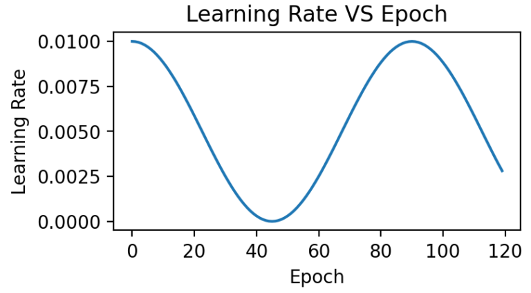
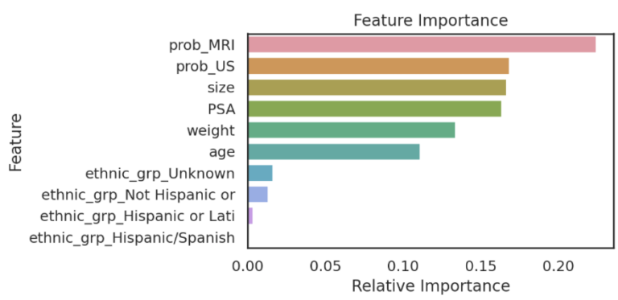

  
<strong>MRI ANALYZER</strong>

  
<strong>Piotr Parkitny | pparkitny@berkeley.edu</strong>

  
<strong>Aidan Jackson | aidanjackson@berkeley.edu</strong>

  
<strong>Dhyani Parekh | dhyanip7@berkeley.edu</strong>

  
<strong>Candice Sener | senercansu@berkeley.edu</strong>

<!-- TABLE OF CONTENTS -->
## Table of Contents

* [Problem Statement](#problem-statement)
* [Dataset](#dataset)
* [Pipeline Journey](#pipeline-journey)
* [Model](#model)
* [Originality](#originality)
* [Impact](#impact)
* [Next Steps](#next-steps)

<!-- PROBLEM STATEMENT -->
## Problem Statement

The MRI Analyzer team’s mission is to aid medical professionals when identifying prostate cancer and determining the best course of follow-up actions. 
MRI Analyzer offers flexibility to patients who only have a partial data record available, qualifies its predictions with uncertainty estimates at each step, and matches in-practice metrics of cancer diagnosis. 
This has the ability to increase the speed with which readings can be performed while maintaining performance and usefulness in a variety of healthcare scenarios.

<!-- DATASET -->
## Dataset

From the National Cancer Institute’s Image Data Commons archive, we obtained the dataset titled Prostate MRI and Ultrasound With Pathology and Coordinates of Tracked Biopsy (Prostate-MRI-US-Biopsy). 

    
  

### Summary of Dataset
This dataset was derived from tracked biopsy sessions using the Artemis biopsy system, many of which included image fusion with MRI targets. Patients received a 3D transrectal ultrasound scan, after which nonrigid registration (e.g. “fusion”) was performed between real-time ultrasound and preoperative MRI, enabling biopsy cores to be sampled from MR regions of interest. Most cases also included a sampling of systematic biopsy cores using a 12-core digital template. The Artemis system tracked targeted and systematic core locations using encoder kinematics of a mechanical arm, and recorded locations relative to the Ultrasound scan. MRI biopsy coordinates were also recorded for most cases. STL files and biopsy overlays are available and can be visualized in 3D Slicer with the SlicerHeart extension.  Spreadsheets summarizing biopsy and MR target data are also available. See the Detailed Description tab below for more information.

MRI targets were defined using multiparametric MRI, e.g. t2-weighted, diffusion-weighted, and perfusion-weighted sequences, and scored on a Likert-like scale with close correspondence to PIRADS version 2. t2-weighted MRI was used to trace ROI contours, and is the only sequence provided in this dataset. MR imaging was performed on a 3 Tesla Trio, Verio, or Skyra scanner (Siemens, Erlangen, Germany). A transabdominal phased array was used in all cases, and an endorectal coil was used in a subset of cases. The majority of pulse sequences are 3D T2:SPC, with TR/TE 2200/203, Matrix/FOV 256 × 205/14 × 14 cm, and 1.5mm slice spacing. Some cases were instead 3D T2:TSE with TR/TE 3800–5040/101, and a small minority were imported from other institutions (various T2 protocols.)

Ultrasound scans were performed with Hitachi Hi-Vision 5500 7.5 MHz or the Noblus C41V 2-10 MHz end-fire probe. 3D scans were acquired by rotation of the end-fire probe 200 degrees about its axis, and interpolating to resample the volume with isotropic resolution.

Patients with suspicion of prostate cancer due to elevated PSA and/or suspicious imaging findings were consecutively accrued. Any consented patient who underwent or had planned to receive a routine, standard-of-care prostate biopsy at the UCLA Clark Urology Center was included.  

### Data Schema
While the original dataset had anonymized health information for over 1,000 patients, it was distributed across several files and sources. Key to joining the correct information was a unique Patient Identifier assigned to each record.

  

### Data Source Files
- Images DICOM 77GB (67K files)
- Target Data (XLSX) 131 (KB)
- Biopsy Data (XLSX) 4.25 (MB)
- STL Files (ZIP) 274 (MB)
- Biopsy Overlays (ZIP) 333 (MB)

### EDA

    
    

  

### Target Feature: Cancerous Percentage of Biopsy
While several parts of the dataset related to patient diagnostics, such as their medical scans or blood tests, even more important was their outcomes related to cancer. The dataset did not indicate directly whether a patient received a diagnosis of prostate cancer or its severity. Rather, it had information relating to the amount and score of cancer found during biopsy. In order to generate a useful set of target labels for supervised training, a patient was labeled as “cancerous” if any of their biopsies had a percentage of cancer greater than zero.

  

### PSA Blood Concentration in nanograms per milliliter 
PSA is a protein produced by the prostate in both healthy and cancerous individuals. In many cases, a blood test measuring PSA concentration will be the first line of prostate cancer detection. It is thought that prostate cancer leads to higher PSA production and thus concentration in the blood, but its use as a screening procedure is often interchanged with the digital rectal exam.

    

<!-- PIPELINE JOURNEY -->
## Pipeline Journey

### Project Environment
The environment used to create and run the algorithms for the MRI Analyzer are on the public cloud- Amazon Web Services. We are running an EC2 instance and within that running the Deep Learning for Ubuntu operating system. Within that, the docker image is based on NVIDIA for PyTorch. The results and dataset are stored in an S3 bucket and we utilized Papermill to run our models.

    

### Data Pipeline
The two key types of information contained for each patient were their medical images, used for the DNN models like ResNet, and other metadata, used for downstream tasks.

    

### Modeling Steps

#### 1. PROCESS DICOM
##### MRI 
- Extract images from MRI DICOM files (multiple)
- Crop image to zoom in on prostate
- Only keep 25 images that are extracted from the middle of the scan
- The resulting image is a 5×5 image grid with a final resolution of 720×720

##### Ultrasound
- Extract images from the MRI DICOM file (only one)
- Crop image to zoom in on prostate
- Only keep 25 images that are extracted from the middle of the scan
- The resulting image is a 5×5 image grid with a final resolution of 1220×1220

  

    
  

#### 2. DATA SET CREATOR
Once the transformations of the primary features, i.e. medical images, were decided upon they were implemented for the entire dataset. Given that these images were ~70 GB originally, efficient motivation and use of these transformations were required to add value while not creating unnecessary labor.

Each image is classified as Pos or Neg for cancer based on the following rule:

Biopsy Data → Cancer in Core %
If Cancer in Core % > 0 | Label = Pos
If Cancer in Core % = 0 | Label = Neg

  

    
  

#### 3. CREATE TRAIN, TEST, AND VALIDATION SET
Since the pipeline features certain models appearing after others, segmenting and ensuring no data leakage occurs during training is especially important. In particular, downstream models need not just a testing set that hasn’t been used earlier in the pipeline, but a unique training set as well. This is because any information seen by a previous model during its training would have been reflected in its final parameters so that the predictions it passes further in the pipeline are incorrectly accurate. Because the previous DNN models are already large enough to “memorize” training examples, this led to especially obvious results if overlooked.  

  
  

  
  
  

#### 4. DEEP NEURAL NETWORK (DNN) MODEL TRAINING
A variety of model architectures, hyperparameters, and data preparation techniques were trained and evaluated to improve the DNN models’ performance. These include:

Use ResNet18/50
Size and resolution of image collages
Various LR, Weight Decay, and other optimization parameters
Various optimization algorithms

  

    
  

#### 5. DEEP NEURAL NETWORK MODELS INFERENCE
Based on team conversations with physicians, published literature, and general medical knowledge, it is expected that MRIs are much more capable of containing cancer-relevant information than ultrasound images. In practice, MRIs are more highly detailed and used for guiding potential biopsies, while ultrasounds’ are used more for the general location of the prostate among other nearby organs.

This was also found in the model results shown on the right, where the MRI DNN had much better performance than the Ultrasound DNN. In particular, the Ultrasound DNN was only slightly better than random. However, the combination of these two pieces of information in later steps was found to be more useful than either on their own. This reinforced the pipeline-based approach of cancer diagnosis, over more traditional single models.

  
  
  

#### 6. FINAL DATA
While some patients will have all attributes about themselves available for making a healthcare decision, others may not. In order to bridge the gap between a single model cancer classifier and a pipeline that is able to take advantage of different data sources, actions to take when a patient does not have all data fields must be decided upon and prepared for in advance. 

This was accomplished in the pipeline by training and evaluating all individuals with the average dataset value for each variable for any which were missing. In total, about one-fourth of the patients in the dataset had at least one missing value for at least one variable. Only the MRI and ultrasound results were found to be critical for classification and could not be substituted with the group average. Therefore, the final product is robust enough to classify patients with at least these attributes while producing the reported metrics below.

  
    

#### 7. FINAL RESULT
Several different supervised classifier models were considered to combine the MRI and ultrasound DNN model predictions with patient metadata in order to make the final cancer prediction. 

Ultimately, a Random Forest classifier was chosen not just because of its AUC metric, but just as importantly because of the types of errors it made. As shown in the ROC graph on the right, the model has a perfect true positive rate. This indicates that every patient who does have cancer is correctly classified by the model. In a healthcare setting, especially with a condition such as cancer, the consequences of a false negative far outweigh the consequences of a false positive. Therefore, while better AUC values were able to be achieved with other models or hyperparameters, this implementation was settled upon because of its better fit for the problem. 

  
    

#### 8. NOVELTY - UNCERTAINTY ESTIMATION
It is sometimes described that the difference between machine learning and classical statistics is that the former focuses on performance while the latter focuses on understanding. Following this notion, when working with human health it is important to not just make a correct prediction but also understand when ambiguity may exist for a specific patient. To include this, uncertainty estimation and propagation were included for each step of the pipeline, shown below, in order to gain this level of understanding. 

  
    

<!-- Model -->
## Model

### Overview
Pipeline is composed of two DNN Models and a final Random Forest Model
- MRI DNN Model – processes MRI Images
- Ultra-Sound (US) DNN Model – processes ultrasound Images
- Random Forest – processes output from MRI and ultrasound model along with patient metadata

  
    

### DEEP NEURAL NETWORK MRI MODEL
#### Model Parameters
- Framework – PyTorch
- Model: Resnet18
- EC2: g4dn.xlarge
- Single Node
- GPU: T4
- Epoch: 120
- Batch Size: 22
- Automatic Mixed Precision
- Pixel Crop: 56
- Images To Use: 25
- LR: Cosine Annealing
- Image Size: 700
- Learning Rate Start: 0.01
- 
#### Features:
- MRI Images

#### Label:
- Biopsy Data → Binary Cancer Presence, from Cancer in Core %
- If Cancer in Core % > 0 | Label = Pos
- If Cancer in Core % = 0 | Label = Neg

  
    
    

  
      

  
    
    

### DEEP NEURAL NETWORK ULTRASOUND MODEL
#### Model Parameters
- Framework – PyTorch
- Model: Resnet18
- EC2: g4dn.xlarge
- Single Node
- GPU: T4
- Epoch: 120
- Batch Size: 22
- Automatic Mixed Precision
- Pixel Crop: 56
- Images To Use: 25
- LR: Cosine Annealing
- Image Size: 700
- Learning Rate Start: 0.01

#### Features:
- US Images

#### Label:
- Biopsy Data → Binary Cancer Presence, from Cancer in Core %
- If Cancer in Core % > 0 | Label = Pos
- If Cancer in Core % = 0 | Label = Neg

  
    
    

  
      

  
    
    

### ENSEMBLE MODEL
- Random Forest Model was selected as it has the best results and the results have no false negatives
- Perfect true positive rate, every patient who does have cancer is correctly classified by the model
- In a healthcare setting, especially with a condition such as cancer, the consequences of a false negative far outweigh the consequences of a false positive

#### Model Parameters
- Framework – scikit-learn
- Model – Random Forrest
- Estimators – 100

#### Features:
-  DNN MRI→ Cancer Probability (0.0-1.0)
- DNN US→ Cancer Probability (0.0-1.0)
- DICOM→ Age | Height | Weight | Ethnicity
- Blood Test → PSA protein concentration

#### Label:
- Biopsy Data → Binary Cancer Presence, from Cancer in Core %
- If Cancer in Core % > 0 | Label = Pos
- If Cancer in Core % = 0 | Label = Neg

  
    
    

  
      

  
    
    

<!-- Originality -->  
## Originality
While combining medical imagery, a computer vision model, and a health outcome is not novel in of itself, many similar projects commonly stop at this point.  Expanding the MRI Analyzer pipeline from the primary medical image, an MRI, to include both Ultrasound images and patient metadata increases its potential performance, but still only provides information on the point estimate of the outcome of interest, i.e. cancer. To expand the value of MRI Analyzer in providing new, useful information, uncertainty estimation was also included for each stage in the pipeline. This quantifies not just how the process would classify an individual in regards to cancer presence, but also how much variability is associated with an individual’s prediction.

### INTRODUCTION TO UNCERTAINTY
Uncertainty is everywhere, both in real life and in the world of statistics, but it is often only quantified for specific occasions. Mathematically uncertainty is analogous to a standard error in statistics, but differs in that it considers both statistical and non statistical sources of error when an estimate is generated.[1] What this means is that in addition to traditional statistical measures of variation, it also includes outside or informal knowledge of how an estimated value could be wrong. This could be a measurement of input data that was incorrect, or an equation that doesn’t reflect the true relationship between its inputs and outputs in the real world. For this reason, it is common to see uncertainty represented as 𝞼 similarly to a standard error, or with a point estimate X be shown as:

X ± 𝞼

X (𝞼)

The advantage of an uncertainty estimate is that often it could be these informal factors that lead to incorrect conclusions. This is especially true in practical settings where data is messy, or in machine learning where models are empirically chosen and fit. Therefore, an evaluation of an uncertainty estimate is often based on what factors it chose to include, and what it chose to ignore or assume was irrelevant.

MRI Analyzer not only provides an uncertainty estimate on the final outcome, a patient’s cancer status, but does so by considering uncertainty at all steps in the pipeline. Only patient metadata, such as the recorded age, height, etc. was assumed to have a negligible amount of uncertainty associated with it. This makes MRI Analyzer both informative and thorough in understanding how a health critical scenario may be processed by black-box like models. The image shown below highlights these stages.

  
      

### IMPLEMENTATION
Formally, when there is some output of a process, the uncertainty associated with it is a function of both the uncertainty in the input and the uncertainty in the process itself. In traditional disciplines of science, the relationship between output uncertainty and these values is usually derived analytically. 

  
      

With machine learning, however, the number and complexity of operations makes this impractical. To address this gap, several literature techniques were incorporated in order to estimate uncertainty and propagate it through each stage in the pipeline. 

The central theme of all the literature techniques used in MRI Analyzer is the Monte Carlo method.[2] This involves a procedure where one component, whose effect on output uncertainty is being estimated, is randomly varied and a prediction is made. After repeating for many iterations, the resulting predictions will form a distribution from which the contribution to output uncertainty from the varied component can be estimated. 

Shown in the pipeline graphic earlier, however, there are many scenarios the Monte Carlo method must be adapted to. Specifically, procedures were implemented to use this method by:

### RESULTS
#### Monte Carlo Fitting
While literature methods allowed for uncertainty estimation to be incorporated into all parts of the pipeline, certain parameters still needed to be adapted to the MRI Analyzer use case. These included:

- Number of forward passes for each simulation
- Dropout probability in DNN Model Uncertainty
- Number and location of dropout layers in DNN Model Uncertainty

Shown from the graphs on the right, these values were found to be:
- 100 forward passes for input uncertainty propagation
- MRI Dropout with 10% probability behind the classification layer only, at least 300 forward passes
- Ultrasound Dropout with 30% probability behind all layers, at least 100 forward passes

The number of forward passes for input uncertainty propagation was chosen to be 100 since further increases did not appear to change the average value of uncertainty in the predicted outcomes. This was found to be true for all locations where input uncertainty is propagated in the pipeline. 

Choosing the implementation parameters of the DNN Dropout method was more complex, and involved a modified grid search as described by the method’s authors.[4] The general need for dropout tuning comes from the fact that if dropout is over utilized, too much information is thrown out in the network for any meaningful uncertainty estimate. Keeping the use of dropout too limited, however, will result in almost identical predictions since very little about the network is changed. Therefore, the best use of dropout is found by a unique loss function that captures when estimates are large enough to capture uncertainty for incorrect predictions but not too large such that correct predictions become overly uncertain. Each prediction still retains its own unique uncertainty estimate, but the cumulative differences for a certain set of dropout parameters can be found and compared to the results of other dropout parameters. For each of the DNN models, a minimum number of forward passes was also found, less than which the estimates were too inaccurate to be chosen by the loss function.

  
    
    

  
    
    
    

#### Uncertainty Estimates on Test Data
General trends of the uncertainty estimates can be observed from the graphs on the right:
- MRI-DNN combined uncertainty is mostly uniform, between 8-14%
- US-DNN combined uncertainty is more variable, between 6-15%
- Random Forest combined uncertainty is much larger towards ambiguous cancer probabilities closer to 50%

The following conclusions may be drawn from these uncertainty estimates:
- Higher uncertainty at ends of DNN range, along with presence of incorrect predictions, demonstrates extreme point estimates not indicative of correct classification
- Binary classification, as demonstrated by the Random Forest results, is where uncertainty adds least value compared to intuition

For the purpose of the pipeline, an “uncertain estimate” was defined as one which was within ± 2𝞼 from the decision boundary of 50% predicted probability of cancer.

  
    
    
    

  
    
    
    

#### References
[1] Farrance, I., & Frenkel, R. (2012). Uncertainty of Measurement: A Review of the Rules for Calculating Uncertainty Components through Functional Relationships. The Clinical biochemist. Reviews, 33(2), 49–75.

[2] Papadopoulos, Christos & Yeung, Hoi. (2001). Uncertainty estimation and Monte Carlo simulation method. Flow Measurement and Instrumentation. 12. 291-298. 10.1016/S0955-5986(01)00015-2. 

[3] Gal, Yarin & Ghahramani, Zoubin. (2015). Dropout as a Bayesian Approximation: Representing Model Uncertainty in Deep Learning. Proceedings of The 33rd International Conference on Machine Learning. 

[4] Yarin Gal, Jiri Hron, and Alex Kendall. 2017. Concrete dropout. In Proceedings of the 31st International Conference on Neural Information Processing Systems (NIPS’17). Curran Associates Inc., Red Hook, NY, USA, 3584–3593.

<!-- IMPACT -->
## Impact
The impact of machine learning on medicine and healthcare continues to increase. Many examples in literature or in the news focus on singular models making new progress on specific problems. However, the task of providing a service to a large number of potential patients requires a broad based solution. In particular, to enter production it will need to be one that is robust against differences in patient background or available information while still offering the competitive performance.

This project provides a minimum viable product for a best performing, end-to-end pipeline that is able to take a variety of patient information and provide a prostate cancer diagnosis. With over 1100 patients in the project dataset featuring a variety of healthcare institutions, medical procedures, and information available about each individual, this product is much more likely to be robust to new clinical settings and patients. In addition, the use of uncertainty estimation can provide context for when a patient’s status may be ambiguous and flagged for a manual follow up.

Specifically, MRI Analyzer compares to recent publications in the following way:

  
      

Note that the AUC-ROC reported above is found from the full curve, as used in other literature examples. Elsewhere on this site both the full curve and single point value from the 50% decision boundary are reported.

### USE CASE #1: FLEXIBLE PIPELINE
MRI Analyzer’s larger, more diverse dataset, coupled with robust training, makes it better prepared to treat patients from a wide variety of backgrounds and in differing circumstances. As described on the Dataset page, various scanning procedures and equipment were used and differed from patient to patient. This variety both makes the pipeline more robust for patients in across backgrounds in the future, but also likely helped to prevent overfitting to the training set currently. 

Further, a patient only needs an MRI and Ultrasound scan in order for a classification to be made in line with model training and evaluation. All other variables, including levels of Prostate Specific Antigen (PSA) from blood tests and all patient metadata, were imputed with the training group’s average whenever missing for a patient. Therefore, the best performing AUC-ROC metric includes these cases of partial missing data. While only future evaluation on new patients will reveal whether this performance continues, receiving competitive scores on the current dataset with this method indicates that this flexibility is within reach for patients.

### USE CASE #2: UNCERTAINTY QUANTIFIER
The inclusion of full-pipeline uncertainty estimates not only provides better context for an individual cancer prediction, but also can be used to improve processing of patients in bulk. 

  
      

The image above demonstrates how an individual with an ambiguous point estimate can be better understood with an accompanying uncertainty estimate. In this case, one patient had a predicted probability just under ~40%. For the simple scenario of binary classification, a naive baseline may be to flag anyone between 30-70% because of their proximity to the decision boundary. In this case, however, this individual was correctly classified despite their near-ambiguous point estimate. This is reflected with a quantified uncertainty estimate that is much lower than its neighbors in this same baseline, which were incorrectly classified. Although there are visible examples of patients which were both certain and incorrectly classified, uncertainty can still demonstrate better filtering of ambiguous patients. 

### USE CASE #3: PRIORITIZATION TOOL

  
      

Many elective operations and surgeries were postponed or cancelled during the COVID-19 pandemic. This meant that all of the patients whose doctors were suspecting them of having cancer had to postpone their biopsy operations. As a result, patients who were having symptoms of prostate cancer had to wait until COVID-19 had passed in their area or until their symptoms worsened. To better serve patients who are most in need, doctors can use MRI Analyzer as a complementary tool to predict point estimate probabilities of cancer along with uncertainty estimates on a patient by patient basis.

For example, a patient goes to the doctor since he is making very frequent bathroom visits and has seen blood in their urine. The doctor takes blood samples and also sends the patient for an MRI scan. Due to COVID-19, many patients cannot proceed beyond the MRI scan without further certainty of their condition. Instead of waiting for worsening symptoms, MRI Analyzer can be a supplementary tool to determine the cancer status along with a quantification of its uncertainty for the patient. In particular, for scenarios with high demand for medical resources such as COVID-19, MRI Analyzer makes the evaluation process more efficient so doctors can spend time better focused on patients and situational needs.

References:
[1] Sonn GA, Fan RE, Ghanouni P, Wang NN, Brooks JD, Loening AM, Daniel BL, To’o KJ, Thong AE, Leppert JT. Prostate Magnetic Resonance Imaging Interpretation Varies Substantially Across Radiologists. Eur Urol Focus. 2019 Jul;5(4):592-599. doi: 10.1016/j.euf.2017.11.010. Epub 2017 Dec 7. PMID: 29226826.
[2] Minh Hung Le et al 2017 Phys. Med. Biol. 62 6497
[3] Yoo, S., Gujrathi, I., Haider, M.A. et al. Prostate Cancer Detection using Deep Convolutional Neural Networks. Sci Rep 9, 19518 (2019). 

<!-- NEXT STEPS -->
## Next Steps
### EXPAND PIPELINE
- MRI Analyzer’s pipeline is currently automated and only requires specifying an input folder that contains the training dataset
- Incorporating other cancer types with new copies of MRI Analyzer’s pipeline can broaden its usefulness

Additional datasets:
- Prostate Cancer:  PRAD-CANADA – 392 subjects
- Breast Cancer: Breast Cancer Screening-DBT – 985 subjects
- Colon Cancer: CT Colongraphy (ACRIN 6664) – 825 subjects
- Lung Cancer: NSCLC-Radiomics – 422 subjects
- Kidney Cancer: C4KC- KiTS – 210 subjects

  
      

### ADD OBJECT SEGMENTATION VIA YOLO5
Because each medical scan contains several slices, each of which may or may not include cancer, current processing for computer vision models requires:
- Creating a single label for each scan
- Manually cropping each image slice to only the interior portion, which is centered on the prostate
- Dropping the first and last sets of image slices, which contain no / the least amount of prostate
- Combining the remaining image slices into a collage
Object segmentation can be incorporated into the pipeline via the YOLO5 model to improve processing. The updated pipeline would only require:
- Inputting a single MRI scan
- Extracting the prostate from within each slice, if present, automatically via the trained YOLO5 model
- Combining the extracted prostate images into a higher resolution, less noisy collage

This would have the advantage of providing more relevant information into each computer vision model, likely increasing performance.

  
      

### CANCER SLICE CLASSIFICATION
The original dataset provided cancer information in the form of biopsy results for each patient, which was used to generate the cancer / no cancer label. 

In addition, 3-D coordinates were also provided which mapped each biopsy sample to its location in the patient’s corresponding MRI image.

Incorporating this information in a useful way for either image pre-processing, or as a feature into the computer vision models, will allow more detailed learning of how image features relate to cancer outcomes. This is a unique feature of the current dataset and will likely increase performance.

  
      

### IMAGE CHANNELS & OVERCOMING HARDWARE LIMITATIONS
Images that have been used for this study were put into a single channel collage due to hardware memory limits. For the same reason, it was also required to lower image resolution within the collage. Both of these adjustments likely affected model training and performance. With more powerful hardware from future funding, images could instead be processed in a multichannel format corresponding to the physical location within the body. This could also provide the opportunity to keep images at higher resolutions where more details are available to the model. Each of these changes would likely increase performance as more information is available to the computer vision models.

  
      

### RELATED RESEARCH
In a separate application of ResNet to prostate cancer detection (4), diffusion-weighted MRI images were used as an input with 319 training and 108 testing patients. Five stacked ResNet17 models were used in an ensemble in order to make slice-level classifications, which were then used to generate a single patient level classification. This is shown in the image on the right.

The reported AUC-ROC was 0.84 – 0.90 at the slice level and 0.76 – 0.91  at the patient level. Slice level indicates a prediction of whether or not an individual MRI slice had a prostate cancer tumor, while patient level indicates whether an entire MRI scan for a patient had a prostate cancer tumor. 

In a statistical study that was conducted by Smith RP, et.al. (2), researchers analyzed historical data to see whether prostate cancer could be detected and diagnosed accurately based on the PSA (Prostate Specific Antigen) results. Specifically, they compared the PSA results of 977 patients with confirmed prostate cancer diagnosis against different clinically significant PC thresholds. The research concludes that the almost two thirds of the patients were diagnosed as having a prostate cancer based on the aligned results of the biopsy data and the PSA screening results. 

Furthermore, in a study by Sonn et. al. (3), individual radiologists were assessed for how they evaluated MRI scans for prostate cancer. Nine radiologists provided a PIRADS score for different MRIs, which is a procedural metric when evaluating an MRI. The scores were used in a logistic regression in order to predict the clinical significance of cancer. Results showed both the PIRADS score distribution as well as the yield of clinically significant cancer varied across individuals. The research also found that the variability amongst radiologists was not due to factors such as education, training levels, etc. 

Finally, in an article by Minh Hung Le et al. (1), researchers created a CNN and SVM ensemble to distinguish between clinically significant and insignificant prostate cancer from 364 patients. With a small dataset, they explored different data augmentation methods in order to improve results. It was found that fusion of CNN features did not guarantee an improvement in results. As a result, they used a new fusion method to create a feature learning process where data is more consistent with less variety. The results showed that the new fusion model demonstrated better performance compared to the other two methods also attempted in the study. 

  
      

References:

Le, M. H., Chen, J., Wang, L., Wang, Z., Liu, W., Cheng, K.-T. (T., & Yang, X. (2017). Automated diagnosis of prostate cancer in multi-parametric MRI based on multimodal Convolutional Neural Networks. Physics in Medicine & Biology, 62(16), 6497–6514. https://doi.org/10.1088/1361-6560/aa7731
Smith, R. P., Malkowicz, S. B., Whittington, R., VanArsdalen, K., Tochner, Z., & Wein, A. J. (2004). Identification of clinically significant prostate cancer by prostate-specific antigen screening. Archives of Internal Medicine, 164(11), 1227. https://doi.org/10.1001/archinte.164.11.1227
Sonn, G. A., Fan, R. E., Ghanouni, P., Wang, N. N., Brooks, J. D., Loening, A. M., Daniel, B. L., To’o, K. J., Thong, A. E., & Leppert, J. T. (2019). Prostate magnetic resonance imaging interpretation varies substantially across radiologists. European Urology Focus, 5(4), 592–599. https://doi.org/10.1016/j.euf.2017.11.010

Yoo, S., Gujrathi, I., Haider, M. A., & Khalvati, F. (2019). Prostate cancer detection using deep convolutional neural networks. Scientific Reports, 9(1). https://doi.org/10.1038/s41598-019-55972-4
